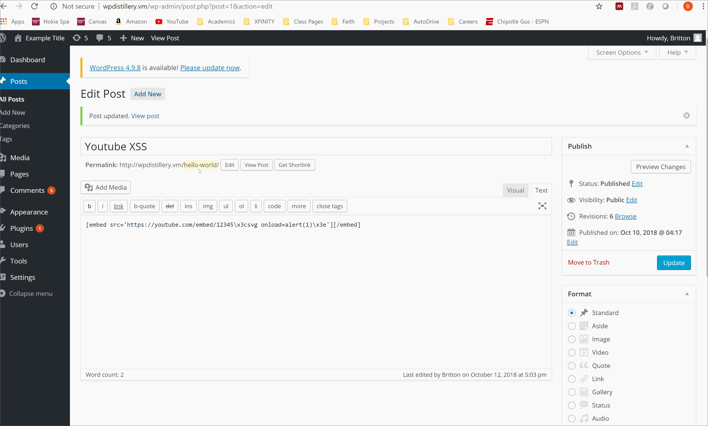
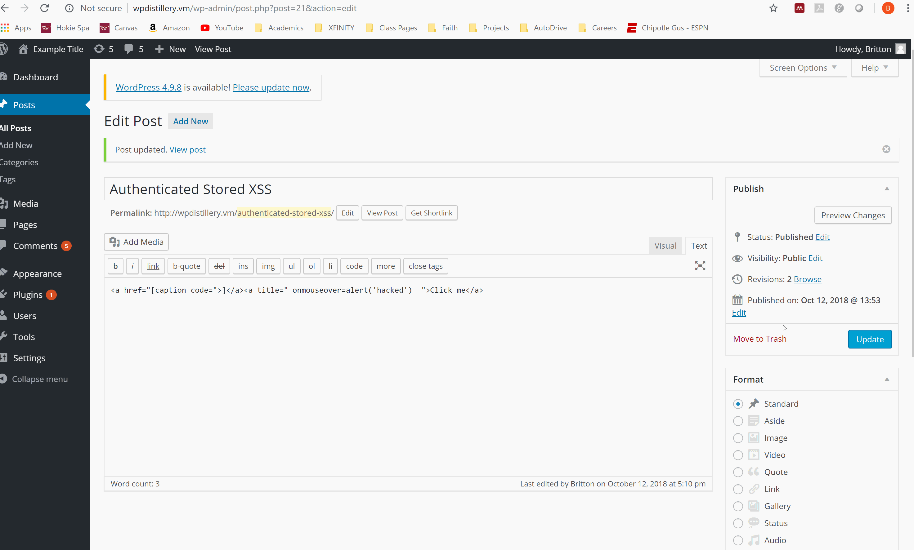

# Project 7 - WordPress Pentesting

Time spent: 6 hours spent in total

> Objective: Find, analyze, recreate, and document **three vulnerabilities** affecting an old version of WordPress

## Pentesting Report

1. (Required) Authenticated Stored Cross-Site Scripting (XSS) in YouTube URL Embeds
  - [x] Summary: 
    - Vulnerability types: XSS
    - Tested in version: 4.2
    - Fixed in version: 4.2.13
  - [x] GIF Walkthrough: 
  - [x] Steps to recreate:
        -(Following the steps from https://blog.sucuri.net/2017/03/stored-xss-in-wordpress-core.html)
        -Create a new post or page
        -Include an embedded youtube linke with an alert tag on the end of it
  - [x] Affected source code:
    - [Link 1](https://github.com/WordPress/WordPress/commit/419c8d97ce8df7d5004ee0b566bc5e095f0a6ca8)
2. (Required) Authenticated Shortcode Tags Cross-Site Scripting (XSS)
  - [x] Summary: 
    - Vulnerability types: XSS
    - Tested in version: 4.2
    - Fixed in version: 4.2.5
  - [x] GIF Walkthrough: 
  - [x] Steps to recreate:
        -(Following the steps from http://blog.knownsec.com/2015/09/wordpress-vulnerability-analysis-cve-2015-5714-cve-2015-5715/)
        -Create a new post or page
        -Include an embedded youtube linke with an alert tag on the end of it
  - [x] Affected source code:
    - [Link 2](https://github.com/WordPress/WordPress/commit/f72b21af23da6b6d54208e5c1d65ececdaa109c8)
3. (Required) Authenticated Stored Cross-Site Scripting (XSS)
  - [x] Summary: 
    - Vulnerability types: XSS
    - Tested in version: 4.2
    - Fixed in version: 4.2.3
  - [x] GIF Walkthrough: 
  - [x] Steps to recreate: 
        -(Following the steps from https://klikki.fi/adv/wordpress3.html)
        -Create a new post or page
        -Include an embedded youtube link with an alert tag on the end of it
  - [x] Affected source code:
    - [Link 3](https://core.trac.wordpress.org/changeset/33359)

## Assets

## Resources

- [WordPress Source Browser](https://core.trac.wordpress.org/browser/)
- [WordPress Developer Reference](https://developer.wordpress.org/reference/)

GIFs created with [LiceCap](http://www.cockos.com/licecap/).

## Notes

Many vulnerabilites shown with wpscan (using the various links) did not lead to repeatable results.

## License

    Copyright 2018 Britton Lee

    Licensed under the Apache License, Version 2.0 (the "License");
    you may not use this file except in compliance with the License.
    You may obtain a copy of the License at

        http://www.apache.org/licenses/LICENSE-2.0

    Unless required by applicable law or agreed to in writing, software
    distributed under the License is distributed on an "AS IS" BASIS,
    WITHOUT WARRANTIES OR CONDITIONS OF ANY KIND, either express or implied.
    See the License for the specific language governing permissions and
    limitations under the License.
